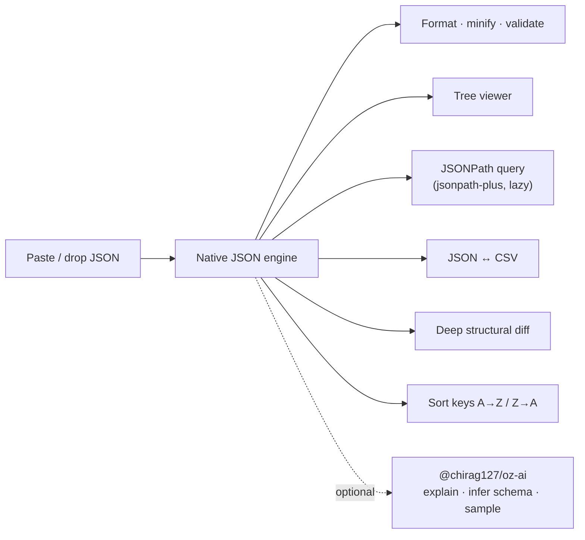

# oriz-json

> JSON power tool that runs 100% in your browser — format, validate, tree view, JSONPath, JSON↔CSV, diff, sort keys.

[](./LICENSE)
[](https://github.com/chirag127/oriz-json/stargazers)
[](https://github.com/chirag127/oriz-json/commits/main)
[](https://astro.build)
[](https://json.oriz.in)

- **Live app:** https://json.oriz.in _(canonical — Cloudflare Pages)_
- **About / info:** https://chirag127.github.io/oriz-json/ _(GitHub Pages landing)_
- **Repo:** https://github.com/chirag127/oriz-json
- **llms.txt:** https://json.oriz.in/llms.txt

JSON power tool that runs entirely in your browser — format, minify, validate, explore as a tree, query with JSONPath, convert JSON ↔ CSV, diff two JSONs, and sort keys.

**100% client-side — no upload, no signup, no server, free.** Your JSON never leaves the tab.

**⭐ If this is useful, please [star the repo](https://github.com/chirag127/oriz-json/stargazers) — it helps others find it.**

## How it works



## Features

- **Format / minify / validate** — beautify with 2/4/tab indent, minify, live validity with line:col error location + byte/node/key/depth stats.
- **Tree viewer** — collapsible tree with organic branch connectors, expand/collapse-all, syntax-colored values.
- **JSONPath query** — run `jsonpath-plus` expressions (`$..author`, `$.items[*]`), lazy-loaded on first use.
- **JSON ↔ CSV** — array-of-objects → CSV (union columns, RFC-quoting) and CSV → JSON (typed coercion).
- **Diff** — deep structural diff of two JSONs with add/remove/change summary and per-path detail.
- **Sort keys** — recursive A→Z / Z→A key sort.
- **AI (optional)** — explain a structure, infer a JSON Schema, or generate sample JSON via [`@chirag127/oz-ai`](https://github.com/chirag127/oz-ai) (g4f, no key). Degrades gracefully; core tools work offline.

## Privacy

All parsing, diffing, querying, and conversion use the browser's native `JSON` engine and local JS. Nothing is transmitted. The only network call is the optional AI feature, which you trigger explicitly.

## Tech

Astro (static) · React 19 islands · Tailwind v4 · PWA-installable · shared `@chirag127/oz-*` packages. Heavy libs are dynamically imported only when their feature is used, keeping first paint instant.

## Develop

```bash
npm install --legacy-peer-deps
npm run dev
npm test        # vitest — pure-logic unit tests
npm run build   # static output → dist/
```

Two surfaces: the CF Pages **live app** (`json.oriz.in`) and a separate GitHub Pages **info page** (`gh-info/`, deployed by `.github/workflows/gh-pages-info.yml`).

## Part of the oriz family

One of ~80 small, fast, single-purpose tools and sites in the **oriz** fleet — see [blog.oriz.in](https://blog.oriz.in) for how it's built and run solo. Sibling tools: [diagram.oriz.in](https://diagram.oriz.in) · [case.oriz.in](https://case.oriz.in) · [name.oriz.in](https://name.oriz.in) · [resume.oriz.in](https://resume.oriz.in).

**Cost:** $0 — static build hosted free on Cloudflare Pages; AI is keyless (g4f) and client-side.

## Contributing

Issues and PRs welcome. Conventional commits are the changelog.

## Author

Chirag Singhal · chirag@oriz.in

## Status

Stable.

## License

MIT © 2026 Chirag Singhal
